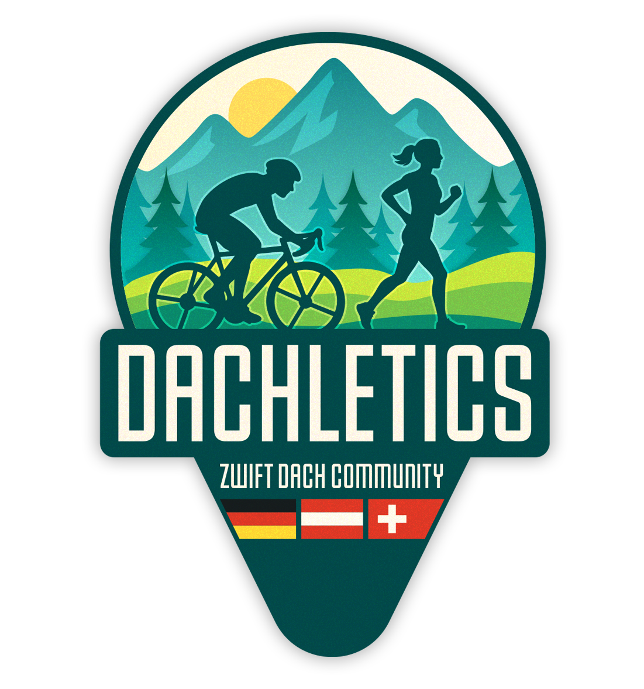

# :mountain_bicyclist: DACHletics Indoor Cycling Guide
Umfangreiche Zusammenstellung sämtlicher Indoor Radfahr und Lauf Themen

# Was ist DACHletics?
DACHletics ist eine Community für alle Zwifter:innen aus Deutschland, Österreich und der Schweiz - egal ob du auf dem Rad unterwegs bist oder läufst.

- Austausch zu Setups, Training, Technik
- Gruppenfahrten, Lauf-Sessions & Events
- Für Einsteiger & Fortgeschrittene
- Fokus auf Gemeinschaft, Motivation & Spaß

[Discord](https://discord.com/invite/g2XfYcC8YH) | [Instagram](https://www.instagram.com/dachletics) | [Zwift Club](https://www.zwift.com/clubs/f9a7bb73-6ee6-474c-9217-6e7d416a0c13/home) | [ZwiftPower](https://zwiftpower.com/team.php?id=23128) | [Strava](https://www.strava.com/clubs/1700035)
 
  
> [!NOTE]
> Diese Zusammenstellung ist immer in Arbeit und wird immer nach bestem Gewissen geupdated. Möchtet ihr etwas hinzufügen könnt ihr gerne einen Pull Request senden oder im Discord euch mit uns austauschen. Wir freuen uns auf Hilfe!
> Sollten manche Fragen hier nicht beantwortet werden, meldet euch auch gerne auf unserem Discord Server. Wie versuchen so gut es geht zu helfen!

# :page_with_curl: Inhaltsverzeichnis
- [:computer: Plattformen](#computer-plattformen)
- [:wrench: Hardware](#wrench-hardware)
  - [:cd: Rollentrainer](#cd-rollentrainer)
  - [:bicyclist: Trainerbikes](#bicyclist-trainerbikes)
  - [:heart: Herzfrequenzsensor](#heart-herzfrequenzmesser)
  - [:dash: Ventilatoren](#dash-ventilatoren)
- [:bar_chart: Community Seiten / Projekte]()

 
  

# :computer: Plattformen
Eine der wohl ersten Fragen die man sich stellt: Welche Plattform ist für mich die richtige?  
Die größte Community hat momentan noch Zwift. MyWoosh ist grade durch das Preismodell auf dem Vormarsch.
  
Eine kostenlose Testversion von einigen Tagen bieten viele an. So kann man alle testen und seine Lieblingsplattform rausfinden.

| Plattform    | Plattformen | Funktionen | Preis (Monat) | 
| ---------- | ---------- | ---------- | ---------- | 
| Zwift | Windows, macOS, iOS, Android, Apple TV | Virtuelle Welten, soziale Rennen & Events, Workouts, XP, Drops, Clubs, Companion-App, Drafting | ~ 20€ | 
| MyWhoosh | Windows, macOS, iOS, Android | 700+ Workouts, virtuelle Welten, Rennen (inkl. Preisgeld), Clubs, UCI-Esports-WM Plattform | Kostenlos | 
| Rouvy | Windows, macOS, iOS, Android, Apple TV | Real-World-Video mit AR-Effekten, strukturierte Pläne, Gruppenfahrten, Trainingsdatenanalyse | ~ 15€ | 
| TrainerRoad | Windows, macOS, iOS, Android | KI-gestützte strukturierte Trainingspläne, Performance-Analysen, Fokus auf Trainingseffektivität | ~ 22$ | 

 
  

# :wrench: Hardware

  

## :cd: Rollentrainer
Wer gerne sein normales Rad benutzen möchte ist auf einen Rollentrainer angewiesen. Hier findet ihr eine Liste mit aktuellen Modellen.

> [!TIP]
> Wer kein Rad besitzt kann auch bei Kleinanzeigen öfters Rennräder zu günstigen Preisen kaufen.

| Name    | Schnittstellen | Genauigkeit | Steigung | Preis | Geizhals |
| ---------- | ---------- | ---------- | ---------- | ---------- | ---------- |
| Wahoo KICKR Core | ANT+, ANT+ FE-C, Bluetooth  | ± 2 % Power Accuracy | ± 16 % | ~400€ | [Link](https://geizhals.de/wahoo-fitness-kickr-core-rollentrainer-v176738.html) |
| Tacx NEO 2T | ANT+, Bluetooth (FE-C etc.) | ± 1 % Power Accuracy | ± 25 % | ~1.000€ | [Link](https://geizhals.de/tacx-neo-2t-smart-rollentrainer-t2875-a2146080.html) |
| Elite Direto XR | ANT+, Bluetooth (Standard Smart-Train.) | ± 1,5 % Accuracy (OTS) | ± 24 % | ~600€ | [Link](https://geizhals.de/elite-direto-xr-rollentrainer-v184253.html) |
| Wahoo KICKR Move | ANT+, Bluetooth (Multi-BLE), Wi-Fi, Direct Connect (Ethernet optional)  | ± 1 % Accuracy & Auto-Calibration | ± 20 %  | ~1.150€ | [Link](https://geizhals.de/wahoo-fitness-kickr-move-rollentrainer-wfbktr123-a3021358.html) |

## :bicyclist: Trainerbikes
Wenn ihr gerne ein komplett Paket haben möchte ist mit diesen Trainern gut aufgehoben. Das Zwift Ride ist ein komplett Paket mit dem Wahoo KICKR Core und dem Zwift Cog v2. Damit habt ihr alles was ihr braucht um eure erste Runde in den Indoor Cycling Welt zu drehen.

| Name    | Funktionen | Preis |
| ---------- | ---------- | ---------- |
| Zwift Ride |  | ~ 1.300€ | 
| Tacx Neo Bike Plus |  | ~ 3.500€ |
| Wattbike Atom |  | ~ 3.200€ |

## :heart: Herzfrequenzmesser
Ihr könnt im Zweifel auch eure Smartwatch mit Zwift verbinden. Bei der Apple Watch gibt es da ab und an jedoch Probleme, die viele mit diesem [Reddit Beitrag](https://www.reddit.com/r/Zwift/comments/zf36zc/comment/iza3fp0/?tl=de&utm_source=share&utm_medium=web3x&utm_name=web3xcss&utm_term=1&utm_content=share_button) umgehen. 
 
Wer jedoch eine funktioniernde Lösung haben möchte kommt um ein separaten Herzfrequenzmesser nicht drum herum.

| Name    | Schnittstellen | Typ | Preis | Geizhals |
| ---------- | ---------- | ---------- | ---------- | ---------- |
| Wahoo Fitness Tickr Fit | Bluetooth, ANT+ | Arm | ~ 65€ | [Link](https://geizhals.de/wahoo-fitness-tickr-fit-aktivitaets-tracker-a1749831.html) |
| Wahoo Fitness Trackr | Bluetooth, ANT+ | Brust | ~ 75€ | [Link](https://geizhals.de/wahoo-fitness-trackr-herzfrequenz-sensor-wfbthr05w-a3218228.html) |
| Polar H10 | Bluetooth, ANT+ | Brust | ~ 80€ | [Link](https://geizhals.de/polar-h10-m-2xl-herzfrequenz-sensoren-set-v34639.html) |

## :dash: Ventilatoren
Prinzipell eigent sich jeder Ventilator, oft empfohlen wird der Honeywell, da dieser von der Preis- und Leistungsverhältniss einer der besten ist. 
Wichtig ist nur das man überhaupt einen Ventilator nutzt.

| Name    | Funktionen | Preis | Geizhals |
| ---------- | ---------- | ---------- | ---------- |
| Honeywell TurboForce HT900E  | 3 Geschwindigkeitsstufen | ~ 25€ | [Link](https://geizhals.de/honeywell-ht900e-tischventilator-a644967.html)  |
| Wahoo Fitness KICKR Headwind  | 4 Geschwindigkeitsstufen, App Steuerung | ~ 250€ | [Link](https://geizhals.de/wahoo-fitness-kickr-headwind-bluetooth-fan-a1847819.html)   |

  

# :bar_chart: Community Seiten / Projekte

  

https://whatsonzwift.com/
  
https://www.zwiftworkout.com/
  
https://zwiftpower.com/
  
https://zwifthacks.com/

